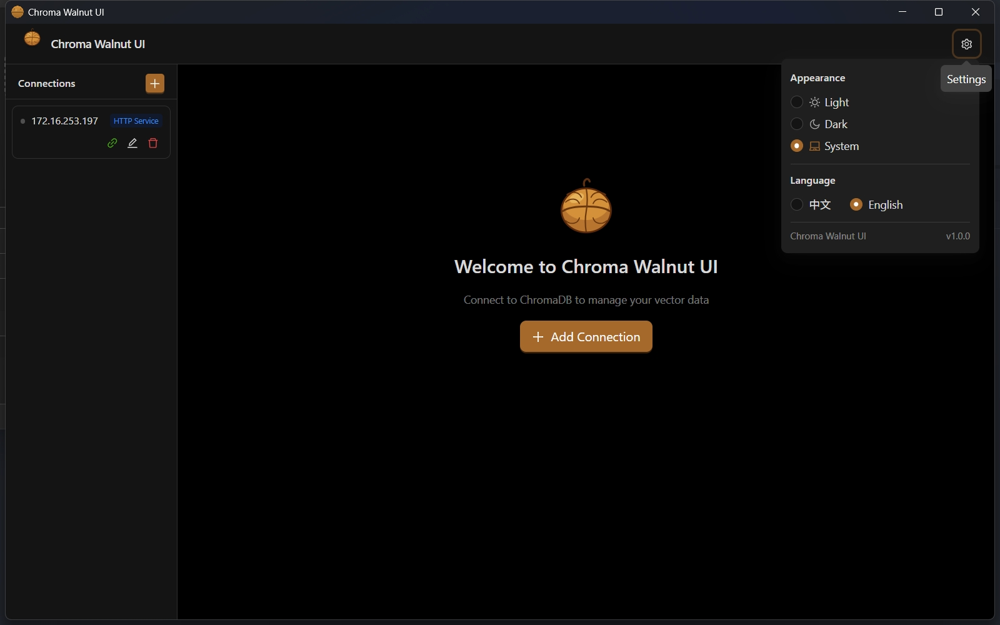
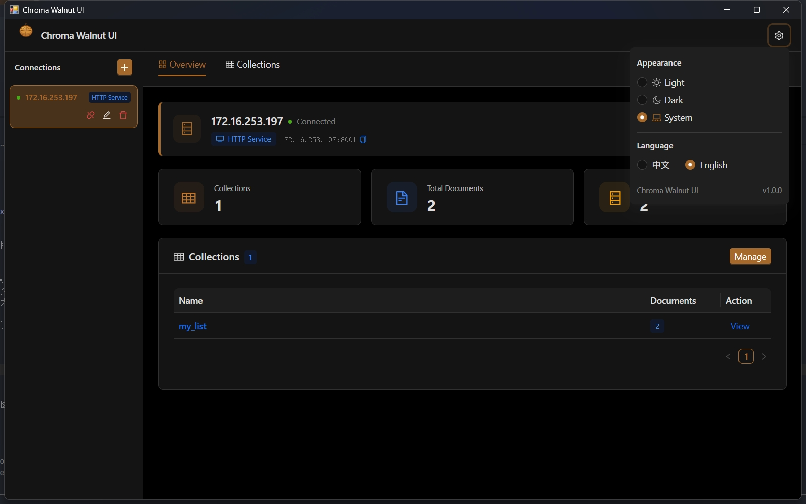

# Chroma Walnut UI

> A ChromaDB visual desktop management tool built with PyWebView + React

**[中文文档](README_CN.md)**

<p align="center">
  
  
  
  
  
  
</p>

---

## Screenshots

<p align="center">
  
</p>

<p align="center">
  
</p>

---

## Introduction

Chroma Walnut UI is a lightweight desktop client for ChromaDB, running as a native window without a browser. It supports multi-connection management, collection editing, document CRUD, and vector similarity search — ideal for developers debugging and managing ChromaDB data locally.

## Features

- **Multi-connection management** — Manage multiple ChromaDB connections (local directory / HTTP service) with Bearer Token auth, one-click connectivity testing, and collapsible sidebar
- **Collection management** — Create, edit (rename + Metadata), and delete collections; key-value Metadata form with duplicate key validation
- **Document browsing** — Paginated view (10 / 20 / 30 per page), showing document ID, content, and color-coded Metadata tags; full JSON modal; text selection enabled
- **Seed test data** — One-click insert of 50 sample Chinese documents for quick testing (requires vector model configured)
- **Vector display** — Optional embedding column with preview and one-click copy
- **Vector search** — Semantic similarity search with multi-condition filter builder (requires vector model configured)
- **Vector model config** — Per-collection OpenAI-compatible embedding API, with presets for Ollama / OpenAI / LM Studio / Qwen; dimension auto-filled after connection test
- **Schema view** — Collection info, vector dimension, and inferred Metadata field types
- **Responsive layout** — Sidebar auto-collapses below 1100 px; fluid font and padding scaling
- **Single instance** — Prevents duplicate windows via socket lock
- **Internationalization** — Chinese / English switching
- **Theme** — Light / Dark / System

## Tech Stack

| Layer | Technology |
|---|---|
| Desktop container | [PyWebView](https://pywebview.flowrl.com/) 6.x |
| Backend | Python 3.12+, [ChromaDB](https://docs.trychroma.com/) 0.6+ |
| Frontend framework | React 19 + TypeScript |
| UI library | Ant Design 6 |
| State management | Zustand 5 |
| i18n | i18next + react-i18next |
| Build tool | Vite 8 |
| Package managers | [uv](https://github.com/astral-sh/uv) (Python) / npm (frontend) |

## Requirements

- Python **3.12+**
- Node.js **18+**
- [uv](https://github.com/astral-sh/uv) (recommended) or pip
- OS: Windows 10 1803+ / macOS 10.15+ / Ubuntu 20.04+

> **Windows**: WebView2 ships with Microsoft Edge — no extra installation needed.  
> **macOS**: No additional system dependencies required.  
> **Linux**: Requires `libwebkit2gtk-4.1-0` and `libgtk-3-0` system packages.

## Quick Start

### 1. Clone the repository

```bash
git clone https://github.com/deepin_sir/chroma-walnut-ui.git
cd chroma-walnut-ui
```

### 2. Install Python dependencies

```bash
# Using uv (recommended)
uv sync

# Or using pip
pip install pywebview chromadb
```

> **Linux only**: install GTK/WebKitGTK system packages first:
> ```bash
> sudo apt-get install -y python3-gi python3-gi-cairo \
>   gir1.2-gtk-3.0 gir1.2-webkit2-4.1 libwebkit2gtk-4.1-dev
> ```

### 3. Install frontend dependencies

```bash
cd frontend && npm install && cd ..
```

### 4. Run

**Production mode** (builds frontend automatically, then opens the window):

```bash
uv run python main.py
```

**Development mode** (hot-reload, ideal for contributors):

```bash
# Starts the Vite dev server (localhost:5173) automatically, then opens the window
uv run python main.py --dev
```

> You can also run `cd frontend && npm run dev` yourself in a separate terminal first — `--dev` reuses an already-running dev server on port 5173.

## Building a Distributable Package

Use the included cross-platform packaging script. Run it on the target OS — PyInstaller cannot cross-compile.

```bash
# Release build (no console window)
uv run python scripts/build.py

# Debug build (console visible — useful for diagnosing startup errors)
uv run python scripts/build.py --debug
```

The script automatically handles: dependency check → frontend build → icon generation → PyInstaller packaging → archive creation.

### Output per platform

| Platform | Output | Archive |
|---|---|---|
| Windows | `dist/ChromaWalnutUI/` | `dist/ChromaWalnutUI-Windows.zip` |
| macOS | `dist/ChromaWalnutUI.app` | `dist/ChromaWalnutUI-macOS.dmg` |
| Linux | `dist/ChromaWalnutUI/` | `dist/ChromaWalnutUI-Linux.tar.gz` |

### End-user runtime requirements

| Platform | Requirement |
|---|---|
| Windows | Windows 10 1803+ / Windows 11 (WebView2 built-in) |
| macOS | macOS 10.15 Catalina+ |
| Linux | `libwebkit2gtk-4.1-0`, `libgtk-3-0` |

> Windows and macOS packages are self-contained — no Python or Node.js needed on the end-user machine.

## Automated Releases via GitHub Actions

Pushing a version tag triggers a three-platform parallel build and creates a GitHub Release automatically:

```bash
git tag v1.0.0
git push origin v1.0.0
```

The workflow (`.github/workflows/release.yml`) runs `scripts/build.py` on `windows-latest`, `macos-latest`, and `ubuntu-24.04` in parallel, then attaches all three archives to the release. Tags containing `-` (e.g. `v1.0.0-beta`) are automatically marked as pre-release.

## Project Structure

The project follows the pywebview-react-template architecture: a generic `backend/core` framework layer, per-feature bridges under `backend/features`, and a frontend `bridge` + generated `api` layer.

```
chroma_ui/
├── main.py                  # Entry: single-instance lock, Vite lifecycle, bridge registration
├── pyproject.toml
├── uv.lock
├── config/
│   └── settings.py          # Global config (window / logging)
├── backend/
│   ├── core/                # Generic framework layer (from pywebview-react-template)
│   │   ├── app.py           # Application: asyncio loop, window lifecycle, shutdown
│   │   ├── bridge.py        # Bridge base class + @exposed routing table
│   │   ├── channel.py       # dispatch() entry for JS calls + batched event push
│   │   ├── config.py        # AppConfig / WindowConfig / LoggingConfig
│   │   ├── window.py        # Window creation, geometry remember/restore
│   │   ├── log.py           # loguru setup (console + rotating file)
│   │   ├── paths.py         # Dev vs PyInstaller path resolution
│   │   ├── event.py         # @event registry (Python → JS push events)
│   │   ├── database.py      # Async SQLite wrapper (unused by this app)
│   │   └── service.py       # DbReadyService base class (unused by this app)
│   ├── features/            # Business bridges — one directory per feature
│   │   ├── connection/      # Connection management (add/test/connect/…)
│   │   ├── collection/      # Collection management
│   │   ├── document/        # Document CRUD + seed test data
│   │   ├── query/           # Vector query
│   │   └── embedding/       # Per-collection embedding model config
│   └── shared/              # Shared services used across features
│       ├── chroma.py        # Multi-connection ChromaDB manager (singleton)
│       ├── embedding.py     # Embedding config persistence + API calls
│       └── icon.py          # Pure-Python walnut icon generator (ICO / ICNS / PNG)
├── scripts/
│   ├── gen.py               # Generate frontend api/event TS from bridges
│   ├── build.py             # Cross-platform one-click packaging script
│   └── build_windows.py     # Windows-only packaging script
├── .github/
│   └── workflows/
│       └── release.yml      # CI/CD: tag → 3-platform build → GitHub Release
└── frontend/
    └── src/
        ├── bridge/          # Generic pywebview bridge: dispatch, events, hooks
        ├── api/             # Per-feature API wrappers (generated by gen.py)
        ├── event/           # Event constants (generated by gen.py)
        ├── store/appStore.ts    # Zustand global state
        ├── i18n/            # zh.ts / en.ts translation files
        ├── layouts/         # App shell with collapsible sidebar
        ├── components/      # Modals, WalnutLogo, FilterBuilder
        ├── pages/           # Overview, Collections, CollectionDetail
        └── tabs/            # Data, Schema, Search tabs
```

After changing bridge method signatures, regenerate the frontend API layer with:

```bash
uv run python scripts/gen.py
```

## Data Storage

User configs live under the home directory; runtime data (logs, window geometry) lives next to the application.

| Path | Description |
|---|---|
| `~/.chroma_walnut_ui/connections.json` | Connection configs (Token stored in plain text — local use only) |
| `~/.chroma_walnut_ui/collection_embeddings.json` | Per-collection vector model configs |
| `<app dir>/data/logs/app.log` | Application log (loguru, rotates at 10 MB, 7-day retention) |
| `<app dir>/data/window_state.json` | Remembered window geometry |

## Vector Model Setup

Chroma Walnut UI works with any OpenAI-compatible Embeddings API:

| Provider | API URL | Model example |
|---|---|---|
| Ollama | `http://localhost:11434/v1/embeddings` | `nomic-embed-text` |
| OpenAI | `https://api.openai.com/v1/embeddings` | `text-embedding-3-small` |
| LM Studio | `http://localhost:1234/v1/embeddings` | as configured |
| Qwen (DashScope) | `https://dashscope.aliyuncs.com/compatible-mode/v1/embeddings` | `text-embedding-v3` |

> Click **Test Connection** before saving — the dimension is auto-filled after a successful test.  
> Each collection can use a different model; make sure it matches the model used when documents were added.

## FAQ

**Q: Blank window on startup?**

A: Check that Python dependencies (especially `pywebview`) are installed. Windows users should verify Edge WebView2 is available. Check `data/logs/app.log` (next to the app) for detailed errors.

**Q: No hot-reload in dev mode?**

A: Make sure `npm run dev` is running inside `frontend/`, and PyWebView is started with `--dev`.

**Q: "Dimension mismatch" error during vector search?**

A: The documents were embedded with a different model or dimension. Use the same model that was used when the documents were added.

**Q: HTTP connection with Token authentication?**

A: Fill in the Token field when adding/editing a connection. It is sent as `Authorization: Bearer <token>`.

**Q: The packaged app fails to start on Windows?**

A: Ensure Microsoft Edge (WebView2 runtime) is installed. On Windows 10 1803+ and Windows 11 it is built-in. Otherwise download the [WebView2 Runtime](https://developer.microsoft.com/en-us/microsoft-edge/webview2/).

**Q: macOS shows "app is damaged" or a security warning?**

A: The app is not code-signed. Right-click → Open, or go to System Settings → Privacy & Security → Allow Anyway. For public distribution, sign the `.app` with `codesign`.

## Contributing

Issues and PRs are welcome. For major changes, please open an issue first to discuss.

## License

[MIT](LICENSE)

## Author

Made with ❤️ by **deepin_sir**
